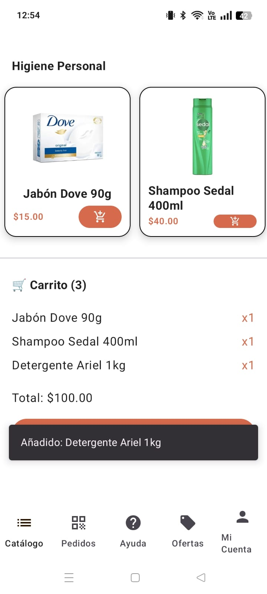

# **SurtiMovil**

Aplicación móvil enfocada en modernizar el proceso de surtido para tiendas de abarrotes, tienditas, minimarkets y pequeños negocios minoristas.

---

## **Integrantes del equipo**
- **Luis Ángel Hernández Corrales**
- **Alejandro Carrasco Maldonado**
- **Manuel Vito Sáenz Montes**

---

## **Responsabilidades durante el sprint**
- **Manuel:** Creación del README, Mejora de pestaña "Catalogo"
- **Alex:** Internacionalización de la aplicación y Mejora de pestaña "Pedidos"
- **Luis:** Actualización de la sección *Help*, Mejora de pestaña "Mi Cuenta" e Implementacion de Login

---

## **Descripción del proyecto**
**SurtiMovil** es una aplicación móvil diseñada para optimizar el proceso de adquisición de productos en el sector abarrotero, incluyendo comestibles, artículos de limpieza y otros productos de consumo masivo.

La aplicación está enfocada en el canal tradicional:
- Tienditas de la esquina
- Minimarkets
- Pequeños comercios minoristas

El objetivo es permitir que los tenderos accedan a un catálogo digital completo, reciban ofertas personalizadas y realicen pedidos de forma ágil y sencilla desde su dispositivo móvil. Esto garantiza mayor eficiencia en las entregas y un ahorro significativo de tiempo y esfuerzo.

---

## **Objetivo principal de la aplicación**
Maximizar la rentabilidad de las pequeñas tiendas y optimizar la cadena de suministro de los distribuidores mediante una plataforma que centraliza:

- Gestión de pedidos
- Aplicación de ofertas exclusivas
- Seguimiento logístico en tiempo real

---

## **Funcionalidades implementadas en este sprint**
- Integración del **carrito de compras**
- Implementación de **internacionalización**
- Actualización de la sección **Help**

---

## **Evidencias visuales**

### Carrito

### Internacionalización

---

## **Evidencia de ramas del equipo**

